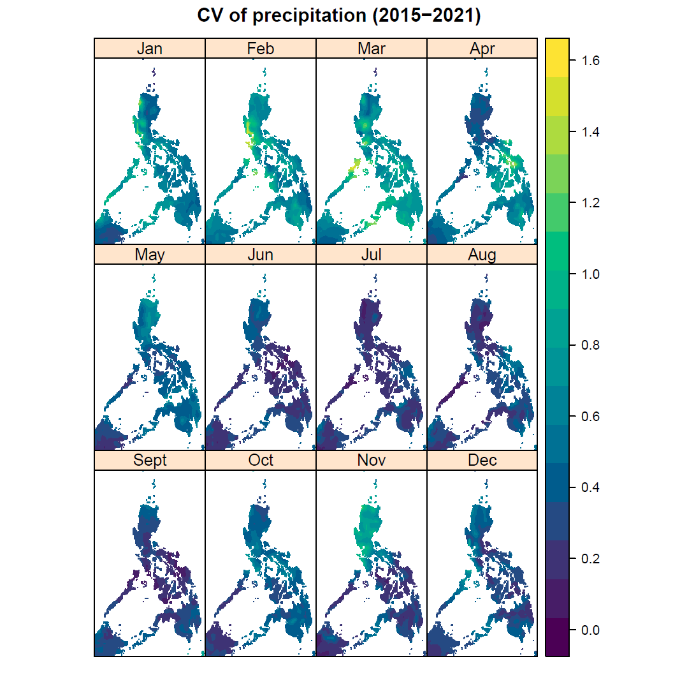

# Variation of select TerraClimate variables from 2015-2021

[TerraClimate](https://www.climatologylab.org/terraclimate.html) is a dataset of climate variables for terrestrial surfaces. I examined the variability of actual evapotranspiration, precipitation, soil moisture, maximum temperature, and minimum temperature in the Philippines from 2015-2021. The coefficient of variation or CV (i.e., standard deviation / mean) was used to measure variability, and maps were plotted per variable, per month as follows:

### Contents:

-   terraclimate_script.R visualizes the variation of climate variables
-   terraclimate_maps.pdf compiles the resulting PDF files generated from the script

### Dataset:

Maps were based on the following NetCDF files downloaded from the [THREDDS data server](http://thredds.northwestknowledge.net:8080/thredds/catalog/TERRACLIMATE_ALL/data/catalog.html):

-   TerraClimate_aet_2015.nc
-   TerraClimate_aet_2016.nc
-   TerraClimate_aet_2017.nc
-   TerraClimate_aet_2018.nc
-   TerraClimate_aet_2019.nc
-   TerraClimate_aet_2020.nc
-   TerraClimate_aet_2021.nc
-   TerraClimate_ppt_2015.nc
-   TerraClimate_ppt_2016.nc
-   TerraClimate_ppt_2017.nc
-   TerraClimate_ppt_2018.nc
-   TerraClimate_ppt_2019.nc
-   TerraClimate_ppt_2020.nc
-   TerraClimate_ppt_2021.nc
-   TerraClimate_soil_2015.nc
-   TerraClimate_soil_2016.nc
-   TerraClimate_soil_2017.nc
-   TerraClimate_soil_2018.nc
-   TerraClimate_soil_2019.nc
-   TerraClimate_soil_2020.nc
-   TerraClimate_soil_2021.nc
-   TerraClimate_tmax_2015.nc
-   TerraClimate_tmax_2016.nc
-   TerraClimate_tmax_2017.nc
-   TerraClimate_tmax_2018.nc
-   TerraClimate_tmax_2019.nc
-   TerraClimate_tmax_2020.nc
-   TerraClimate_tmax_2021.nc
-   TerraClimate_tmin_2015.nc
-   TerraClimate_tmin_2016.nc
-   TerraClimate_tmin_2017.nc
-   TerraClimate_tmin_2018.nc
-   TerraClimate_tmin_2019.nc
-   TerraClimate_tmin_2020.nc
-   TerraClimate_tmin_2021.nc

------------------------------------------------------------------------

Author's note:

The original script was written on 2022-10-13. Latest edits: 2023-10-17.
